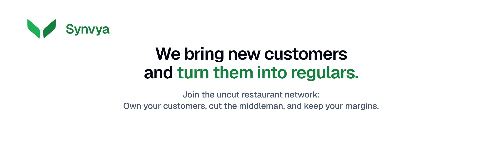

  <a href="https://www.synvya.com">
    <picture>
      
    </picture>
  </a>

   
  <a href="https://synvya.com/">New customers in. Regulars out.</a>
   

---

# New customers in. Regulars out.

Synvya brings new customers and turn them into regulars. And the relationship stays with you. **No commission, no middleman, no app store.**

Delivery apps and directories rent you a customer once, take a cut, and keep the relationship. Synvya does the opposite: every new guest you meet becomes a customer **you** own, along with the data they generate (visits, preferences, repeat behavior).

Learn more and sign up at [synvya.com](https://synvya.com).

## How it works

1. **Put your storefront QR where guests can see it.** On the table tent, the counter, the receipt.
2. **A new guest scans and claims a _Welcome-In_ reward on their first visit.** You just acquired a customer, not a click.
3. **Synvya remembers them.** A _Welcome-Back_ offer earns the return visit.
4. **They become a regular.** And the customer relationship and data stay with you, not a delivery app.

## What restaurants get

- **Two offers that do the work.** _Welcome-In_ to acquire, _Welcome-Back_ to retain. Set them once.
- **Pulse.** Redemptions, new customers, and repeat rate at a glance.
- **A customer directory you actually own.** Not a list rented back to you.
- **Your storefront QR + restaurant page.** One link to share, one code to scan.
- **No commission. No middleman.** You keep the margin and the relationship.

## For diners

- **Explore** the best offers, happy hours, and events nearby.
- **Save** your favorites and the rewards you’ve earned.
- **Scan to claim** _Welcome-In_ and _Welcome-Back_ offers. No email, no phone number, no signup, no app. 

## Why it’s different

- **You own the customer and the data.** Intent, preferences, and repeat visits stay yours, not a closed directory app’s.
- **Built on open protocols.** Your identity and your data are always yours.
- **No commission. No middleman. No monthly tax.** No monthly tax. We make money when you do, on bookings and orders. The rate is flat, never a cut.

## Start here

1. Join the Uncut Restaurant Network at [synvya.com](https://synvya.com)
2. Set up your **Welcome-In** and **Welcome-Back** offers
3. Print your storefront QR and put it where guests can scan

---

Follow us on [Nostr](https://www.primal.net/synvya#notes) or check [synvya.com](https://www.synvya.com) for more details.

---

## For developers

Synvya is **Nostr-native**: restaurants and diners are identified by their own keys. Profiles, menus, offers, happy hours, and events are all publishd on Nostr. No central database owns the relationship; the restaurant does.

### Repos

- **account:** Synvya Restaurant portal (`account.synvya.com`): onboarding, restaurant profile, the two offer slots (Welcome-In / Welcome-Back), Pulse metrics, and the customer directory.
- **diners:** Synvya Diners PWA (`diners.synvya.com`): Explore, saved offers, favorites, and the scan-to-claim flow. No app store, no signup.
- **server:** Backend infrastructure for Synvya Restaurant and Synvya Diners

---

## License

Released under the **MIT License**. See [`LICENSE`](../LICENSE) for the full text.
